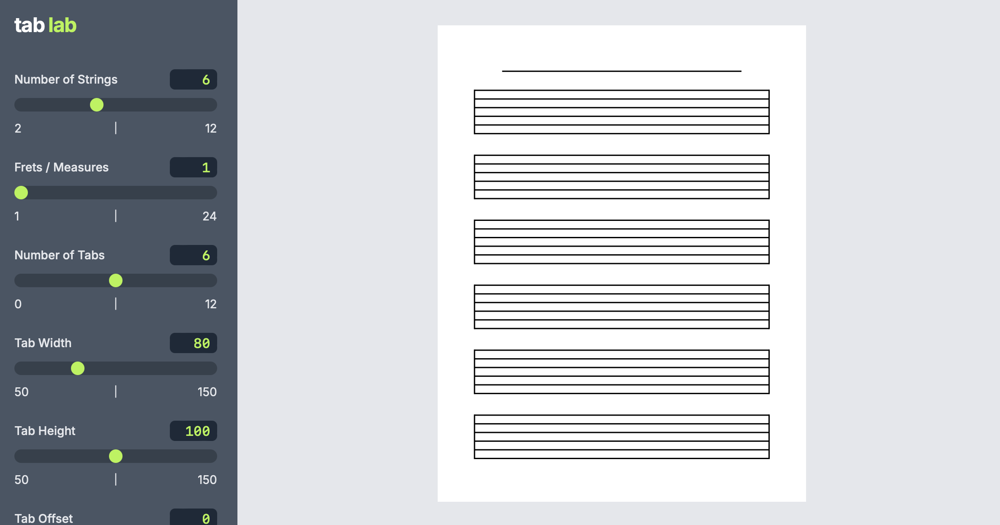
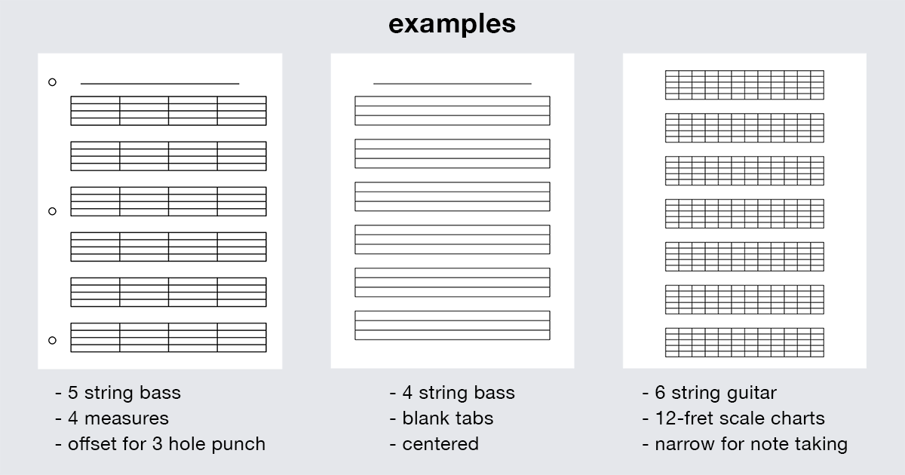

# Tab Lab

View Live - [tab-lab.vercel.app](https://tab-lab.vercel.app)

## Description

Tab Lab is a tool for creating guitar tab templates.

Users can see a preview of the template, make adjustments, then download or print the page.

Includes support for uncommon instruments like 5-string basses and 8-string guitars.

## Table of Contents

- [How to Use](#how-to-use)
- [Examples](#examples)
- [FAQ](#faq)
- [Changelog](#changelog)
- [Links](#links)
- [Contact](#contact)

## How to Use

- **Save:** Saves the template as a PDF.
- **Print:** Prints the template.
- **Number of Strings:** Sets number of strings between 2 and 12.
- **Frets / Measures:** Sets number of vertical lines on each tab row. Set to **none** for plain tabs, or add lines for measures or frets to create scale charts.
- **Number of Tabs:** Sets number of tab rows.
- **Tab Width:** Adjusts width of all tab rows.
- **Tab Height:** Adjusts height of all tab rows.
- **Tab Offset:** Adjusts all tab rows left or right. Useful to make room for 3-hole punch.
- **Tab Gap:** Adjusts space between all tab rows.
- **Line Width:** Adjusts thickness of all tab lines.
- **Header Height:** Adjusts height of page header.
- **Show Header Underline:** Shows or hides header underline at top of page.
- **Show 3 Hole Punch:** Shows or hides 3 hole punch template.

## Examples

## FAQ

### What is a guitar tab template?

Guitar tablature is a visual representation of a guitar neck with lines representing the strings and numbers representing the frets. It is used as a shorthand way to notate guitar music and make it easier to read and play.

These templates are a canvas for musicians to write their own notation on.

### Why did I make this tool?

As a musician, I use tablature often. Whether I'm transcribing a song I want to learn, taking quick notes at band practice, or bringing a catalog of songs to a performance, I use tablature as a quick and easy way to write and read music.

**Many musicians use tablature in a similar way, but finding a template can be surprisingly frustrating.**

In the past, whenever I needed a blank sheet of tab paper, I would search the internet. Sometimes I found something that would work, but I often couldn't. Attempts to create my own templates with programs like Photoshop took a lot of time to create and were difficult to quickly adjust.

The issues most commonly found when searching for tab paper templates include:

- Difficult to navigate websites
- Deceptive file download buttons
- Bombarded with advertisements
- Watermarks or other unwanted text
- No easy way to make adjustments
- Limited options for less common instruments like 5-string bass or 7-string guitar

I built this project to address those issues. This is a simple tool that allows musicians to quickly create the perfect template for their needs.

### What challenges were there in building this project?

The biggest challenge for me personally was finding the right balance between making improvements and getting something complete. In the past, I've found myself taking a long time, or never even finishing a project, all in the pursuit of perfection or "one more thing."

For this project, I made an effort to just get everything working before a self-imposed deadline, then focus on making improvements over time.

**Challenges specific to this project:**

- **CSS on different devices:** A few of the CSS rules I used for sizing were behaving differently on different browsers. For example, using `aspect-ratio` worked as I needed it to in Safari, but not in Chrome. Using the `vh` unit affected the printed page in Safari, but not in Chrome.
- **Printing from different devices:** During testing, I found that different devices and browsers completely changed what would be printed. My solution was to rewrite the CSS in a way that was more stable across devices, as well as provide extra controls for users to make adjustments to compensate for any sizing issues.
- **Handling Different Formats for the Template:** Another challenge was managing the different formats needed for an optimal user experience, particularly SVG and PDF. Initially, I started with a CSS and div-based approach, which was simple but didn't offer the flexibility and precision I needed. Moving to SVG allowed for better control and scalability, but introduced its own set of complexities.

  **SVG vs. PDF:** While SVGs are great for the web—being lightweight, responsive, and easily manipulated with native web technologies—they proved to be less ideal for printing and saving. The solution was converting SVG to PDF. Although I managed to get the SVG and PDF conversion working almost perfectly, there were still issues, especially in Safari, where the PDF wouldn’t render in time for the print dialog, leading to delays. Adding a delay worked but felt slow and unresponsive, so I considered generating PDFs directly from the start to avoid multiple conversions. However, this approach had its own drawbacks. The PDF generation introduced noticeable delays and inconsistencies, particularly when trying to render the PDF in the web UI, where it wasn’t as smooth or reliable as SVG.

  **Deciding on the Best Format:** After testing a few ideas, I realized that it was best to use SVGs for the web because of their native support and better performance across different browsers. PDFs, on the other hand, were more suitable for printing, offering a more consistent and reliable output. I also concluded that achieving a perfect match between what’s displayed in the web browser and what’s printed would be impossible across all devices, browsers, and printers. Therefore, I focused on providing the best web experience with SVGs and the best print experience with PDFs, even if it meant some minor adjustments might be necessary during printing.

  In the end, the solution was to embrace the strengths of each format—SVG for the web and PDF for printing—while accepting the inherent trade-offs.

## Changelog

### v1.0

- Templates generated with HTML and CSS
- Adjustable settings for tab size, page layout, etc.
- Print functionality

### v2.0

- Upgraded to Next.js 14
- Templates generated with SVG and PDF
- Changed adjustment controls from dropdown list to slider input
- Refactoring, organizing, and naming improvements
- Implemented save as PDF functionality
- Improved print preview accuracy
- Improved cross-platform stability
- Improved speed and performance
- Improved accessibility
- Updated UI - fonts, colors, Open Graph, favicon, etc.

### What's next / To-Do?

**Bugs & Improvements:**

- ~~Fix flash of unstyled content issue~~
- ~~Refactor CSS to something other than Styled Components~~
- ~~Improve adjustment controls~~
- ~~Improve printing accuracy on Safari~~
- ~~Improve variable names~~
- ~~Refactor to TypeScript~~
- Refactor sidebar components
- Refactor logo component
- Consider updating fonts

**Features:**

- Implement query params
- Implement presets
- Implement user accounts and saved presets
- Implement options to add bpm, key, etc. labels to header
- Implement light and dark mode
- Implement change paper size

## Built With

- [React](https://reactjs.org/)
- [Next.js](https://nextjs.org/)
- [TypeScript](https://www.typescriptlang.org/)
- [Tailwind CSS](https://tailwindcss.com/)
- [jsPDF](https://github.com/parallax/jsPDF)
- [svg2pdf.js](https://github.com/yWorks/svg2pdf.js)

## Links

- View Live - [tab-lab.vercel.app](https://tab-lab.vercel.app)

## Contact

- Website - [andrewdent.dev](https://andrewdent.dev)
- Email - [andrew@andrewdent.dev](mailto:andrew@andrewdent.dev)
- GitHub - [@andentx](https://github.com/andentx)
- LinkedIn - [Andrew Dent](https://www.linkedin.com/in/andrewdentdev/)
