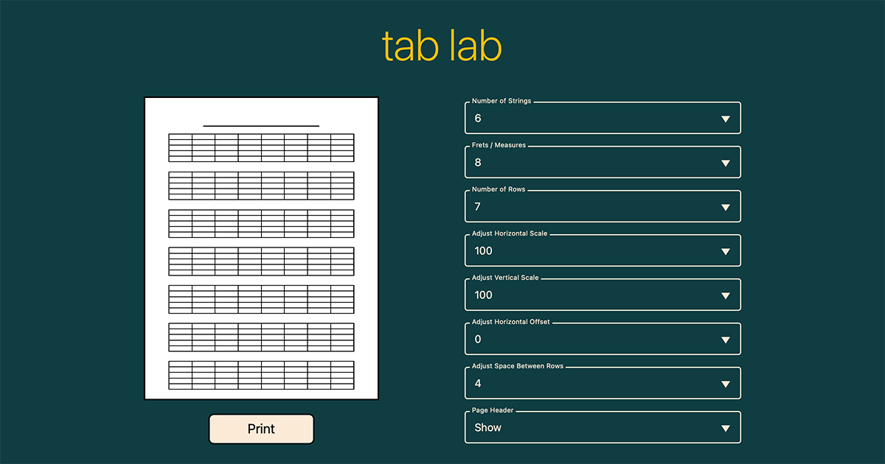

# tab lab

[View live](https://tab-lab.vercel.app)

 

 

## Description

Tab Lab is a tool for creating guitar tab templates.
 
 
Users can see a preview of the template, make adjustments, and download/print the page.
 
 
 

## Table of Contents

- [FAQ](#faq)
- [How to use](#how-to-use)
- [Links](#links)
- [Contact](#contact)

 
 

## FAQ

### What is a guitar tab template?

Guitar tablature is a visual representation of a guitar neck with lines representing the strings and numbers representing the frets. It is used as a shorthand way to notate guitar music and make it easier to read and play.
 
 
These templates serve as a canvas for musicians to write their own notation on.
 
 
 

### Why did I make this tool?

As a musician, I use tablature often. Whether I'm transcribing a song I want to learn, taking quick notes at band practice, or bringing a catalog of songs to a performance, I use tablature as a quick and easy way to write and read music.
 
 
Many musicians use tablature in a similar way, but finding a template can be surprisingly frustrating.
 
 
In the past, whenever I needed a blank sheet of tab paper, I would search the internet. Sometimes I found something that would work, but I often couldn't. Attempts to create my own templates with programs like Photoshop took a lot of time to create and were difficult to quickly adjust.
 
 
The issues most commonly found when searching for tab paper templates include:

- difficult to navigate websites
- deceptive file download buttons
- bombarded with advertisements
- watermarks or other unwanted text
- no easy way to make adjustments
- limited options for less common instruments like 5-string bass or 7-string guitar

 
I built this project to address those issues. This is a simple tool that allows musicians to quickly create the perfect template for their needs.
 
 
 

### What challenges are there in building this project?

The biggest challenge for me personally was finding the right balance between making improvements and getting something complete. In the past I've found myself taking a long time, or never even finishing a project, all in the pursuit of perfection or "one more thing."
 
 
So instead for this project, I made an effort to just get everything working before a self-imposed deadline, then focus on making improvements over time.
 
 
 
<b>Challenges specific to this project:</b>
 
 
<b>CSS-in-JS + SSR = FOUC</b>
 
Working with Styled Components and Next.JS is causing a flash of unstyled content. This is due to the CSS-in-JS being loaded after the initial page load. I either need to figure out how to get SSG (Static Site Generation) working with Next.JS so I can have the Styled Components converted to vanilla CSS at build time and served at initial load, or refactor the Styled Components to a different method of using CSS.
 
 
<b>CSS on different devices</b>
 
A few of the CSS rules I used for sizing were behaving differently on different browsers. For example, using `aspect-ratio` worked as I needed it to in Safari, but not in Chrome. Using the `vh` unit affected the printed page in Safari, but not in Chrome.
 
 
<b>Printing from different devices</b>
 
During testing I found that different devices and browsers completely changed what would be printed. My solution was to re-write the CSS in a way that was more stable across devices, as well as provide extra controls for users to make adjustments to compensate for any sizing issues.
 
 
 

### What's next / to do?

<b>Bugs & Improvements</b>

- Fix flash of unstyled content issue
- Refactor CSS to something other than Styled Components
- Improve adjustment controls
- Improve printing accuracy on Safari

 

<b>Features</b>

- Create themes for light and dark mode
- Create options to add bpm, key, etc. labels to header
- Implement presets
- Implement user accounts and saved presets

 
 

## How to use

<b>Print Safari\*</b>
 
Use this button to print from Safari browser
 
\*printing from Safari or on an iPhone seems to add extra margin that I haven't figured out how to remove yet. This print option reduces the template size to avoid printing an empty 2nd page
 
 
<b>Print Chrome\*\*</b>
 
Use this button to print from Safari browsers
 
\*\*printing from Chrome browser on a desktop produces a more accurate preview and print page
 
 
<b>Number of Strings</b>
 
Set number of strings between 4 and 12
 
 
<b>Frets / Measures</b>
 
Set number of vertical lines on each tab row. Set to <b>none</b> for plain tabs, or add lines for measures or frets to create scale charts
 
 
<b>Number of Rows</b>
 
Set number of tab rows
 
 
<b>Adjust Horizontal Scale</b>
 
Adjust width of all tab rows
 
 
<b>Adjust Vertical Scale</b>
 
Adjust height of all tab rows
 
 
<b>Adjust Horizontal Offset</b>
 
Adjust all tab rows left or right. Useful to make room for 3-hole punch
 
 
<b>Adjust Space Between Rows</b>
 
Adjust space between all tab rows
 
 
<b>Page Header</b>
 
Show or hide header at top of page
 
 
<b>Page Header Height</b>
 
Adjust height of page header
 
 
<b>Adjust Line Size</b>
 
Adjust thickness of all tab lines
 
 
 

## Links

- [View live](https://tab-lab.vercel.app)

 

## Contact

- [Portfolio - andrewdent.dev](https://andrew@andrewdent.dev)
- [Email - andrew@andrewdent.dev](mailto:andrew@andrewdent.dev)
- [GitHub - @andentx](https://github.com/andentx)
- [LinkedIn - Andrew Dent](https://www.linkedin.com/in/andrewdentdev/)
- [Twitter - @andentx](https://twitter.com/andentx)

test
